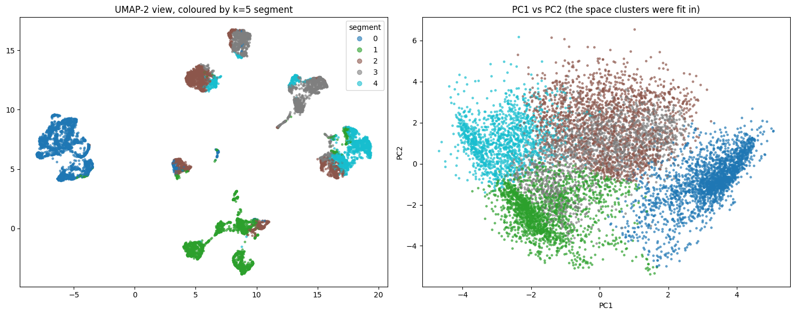

# Credit-Card Customer Segmentation

Unsupervised segmentation of ~9,000 active credit-card holders into five behaviour-based groups, each mapped to a product action (loans, savings plans, wealth management, risk monitoring).

The notebook is written for two audiences: every code cell is preceded by a plain-language explanation of what the step does and what it showed, with technical notes set apart for reviewers.

**Notebook:** [`notebooks/customer_segmentation.ipynb`](notebooks/customer_segmentation.ipynb)

## Result

| # | Segment | Share | Typical customer (medians) | Recommended action |
|---|---|---|---|---|
| 0 | Cash-advance revolvers | 24% | No purchases; 99% take cash advances (1,259); balance 1,497 at 63% of limit; pays ~1.1× minimum; never pays in full | Debt consolidation / personal loan; credit-risk monitoring |
| 1 | Light installment users | 21% | Balance 43; limit 2,500; small installment purchases (315); 62% pay in full at some point; most dormant accounts | Activation campaigns; savings-plan cross-sell; limit increases |
| 2 | Maxed-out heavy users | 20% | Highest balance (2,532) and utilisation (71%); buys both ways (897); 67% also take cash advances; pays ~1.1× minimum | Balance transfer / restructuring; hardship early warning |
| 3 | Occasional big-ticket buyers | 20% | Buys in 17% of months, large single tickets (avg 83), all one-off; balance 818; no installments | Installment / BNPL conversion; retail-partner promotions |
| 4 | Transactors | 16% | Highest spend (1,955), buys every month; limit 6,000 at 8% utilisation; pays ~10× minimum; 73% pay in full | Premium card and rewards; wealth-management cross-sell; retention |



## Method in brief

1. **Clean & engineer.** All 8,950 customers kept (the 313 with missing minimum payment are a real dormant group, imputed as 0). Five behaviour ratios added (utilisation, payment-to-minimum, average purchase size, one-off share, cash advance per transaction); redundant count columns and the near-constant `TENURE` removed. Yeo-Johnson transform + standardisation on 17 features.
2. **Diagnose the geometry.** Hopkins statistic 0.86 (strong cluster tendency). PCA needs 7 components for 90% variance; TwoNN intrinsic dimension 5.4; at matched dimensions PCA preserves neighbourhoods as well as UMAP and better than Kernel PCA (trustworthiness 0.999 at d=8). **The structure is linear.**
3. **Compress.** PCA-7 for clustering; UMAP-2 for plots only.
4. **Compare methods fairly.** K-Means, GMM, Ward and HDBSCAN-on-UMAP, all scored in the *same* reference space (the scaled features). K-Means wins at every k; HDBSCAN fragments into 11–17 groups or scores below K-Means when constrained to five.
5. **Stress-test.** Bootstrap stability (30 refits; k=5 never below ARI 0.78), null baseline (real silhouette 6–7× the column-shuffled baseline), and a linearity check (logistic regression reproduces the segments at 99%, beating gradient boosting).
6. **Profile.** k=5 chosen: on the quality plateau, most stable, every segment 16–24% of customers and nameable on at least three raw variables. k=4 splits a clean segment in half; k=6 adds sub-segments that would receive the same treatment.

Why not UMAP + HDBSCAN, which an earlier pass pointed to: those metrics were computed inside UMAP's own 2-D embedding, which inflates any clustering scored there. The "islands" UMAP draws are the seven combinations of which channels a customer uses at all (one-off / installments / cash advance) — real, but discoverable with three `> 0` checks and not evidence of non-linear structure.

## Reproduce

```bash
git clone <this-repo>
cd <this-repo>
pip install -r requirements.txt
```

The data is the Kaggle dataset
[Market Segmentation in Insurance Unsupervised](https://www.kaggle.com/datasets/jillanisofttech/market-segmentation-in-insurance-unsupervised)
(`jillanisofttech/market-segmentation-in-insurance-unsupervised`). It is not committed here because of the dataset licence; fetch it either way below, then run the notebook top to bottom. Runtime is roughly 8–10 minutes on CPU; the slowest cells are the matched-dimension UMAP/Kernel-PCA comparison and the bootstrap.

**Option A — `kagglehub` (no manual download):**

```python
import kagglehub, os
path = kagglehub.dataset_download("jillanisofttech/market-segmentation-in-insurance-unsupervised")
DATA_PATH = os.path.join(path, "Customer Data.csv")   # use this in the notebook's first cell
```

**Option B — manual:** download `Customer Data.csv` from the Kaggle page, place it in `data/`, and set
`DATA_PATH = "data/Customer Data.csv"` in the first cell.

## Repository layout

```
.
├── README.md                          # this file — summary of method and results
├── requirements.txt
├── .gitignore
├── data/                              # Customer Data.csv goes here (not committed)
├── notebooks/
│   └── customer_segmentation.ipynb    # full annotated analysis with outputs
└── reports/
    └── segments_umap_pca.png          # segment map used above
```

## Caveats

- Segments reflect six months of behaviour and should be re-scored periodically.
- Silhouette values around 0.24 are typical for behavioural data; customers near a boundary are genuinely in-between.
- The dataset has no outcome variable (profit, default, churn). For a live deployment the final validation would be confirming the segments differ on such an outcome.
